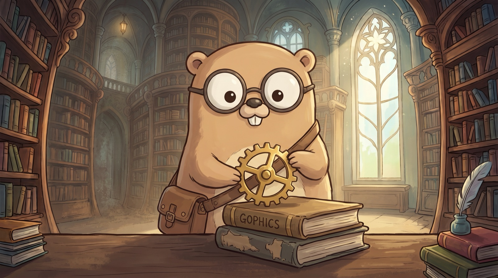

<div align="center">



# Gophics

**Cross-platform native UI, written in pure Go.**

One static binary on desktop and the WebGPU web — and a UI you test headlessly with `go test`, golden images and all.

The rendering pipeline behind the best cross-platform UIs — immutable widgets → element reconciliation → constraint layout → GPU layer compositing — reimagined with idiomatic Go APIs, on a **zero-CGo** WebGPU stack. It draws every pixel itself, so one codebase renders the same UI — from the same renderer — on desktop, web, iOS, and Android, and even in a terminal. No platform forks, no Dart, no JavaScript, no webview, no SDK.

[Quick start](#quick-start) · [Why Gophics](#why-gophics) · [A taste](#a-taste-of-the-api) · [Examples](#examples) · [Architecture](PLAN.md) · [Design notes](design/)

</div>

---

## Why Gophics

Gophics borrows the *architecture* behind the best cross-platform UIs — not their APIs — and leans into what Go does that Dart and JavaScript can't:

- **`go build` is the whole story.** `CGO_ENABLED=0` on desktop and web (mobile binds the same Go into a thin native host). One static binary per platform, cross-compiled from any OS. No SDK, no toolchain doctor, no engine artifacts to install.
- **A library, not an app framework.** Gophics is a `go.mod` line. Pop a window from a CLI, embed a live UI inside a server, or render a widget tree straight to a PNG — headless, no display.
- **Platform services, one Go interface.** File pickers, share sheets, notifications, the clipboard, secure storage, deep links, connectivity, IME, and more are plain `ctx.<Cap>()` calls that light up whatever the host provides and degrade cleanly where it doesn't — no `#ifdef`, no plugin zoo. The web implementations ship and are browser-verified today; native desktop/mobile leaves fill in per release, all zero-CGo.
- **It draws every pixel itself.** A pure-Go WebGPU renderer (vendored in-tree, zero CGo) composites the UI, so it looks identical on every platform — including GPU opacity/blend layers, gradients, shadows, and real text shaping.
- **Real concurrency.** Goroutines plus a single UI thread. Streaming data into a live UI — a chore in most UI stacks — is the easy case here.
- **Everything is `go test`.** Golden-image tests, fuzzing, benchmarks, pprof — ordinary Go tooling, no emulators or bespoke harnesses.
- **No codegen.** Structs, generics, and the standard library. That's it.

### Where it fits

Most cross-platform stacks make you pick two of three. Gophics takes the corner nobody else occupies:

- **Webview wrappers** — Wails, Tauri, Electron: near-single-binary, but you write JS/HTML and inherit each platform's webview quirks.
- **Native-widget bridges** — React Native: real OS widgets, but a JS bridge and per-platform inconsistencies to chase.
- **Own-rendering SDKs** — Flutter, Compose Multiplatform: pixel-perfect and consistent, but a whole SDK and a new language.
- **Own-rendering, but not an app toolkit** — Gio, Ebitengine: the right idea in Go, but immediate-mode / game-loop, not polished widgets.

Gophics is **pure Go, own-rendering, single-binary, and headless-testable** — the consistency of an own-rendering toolkit, without ever leaving Go.

## Quick start

```sh
go run ./examples/hello    # a colored, vsynced, resizable window
go run ./examples/todo     # a real widget app: state, taps, hover, text input
go run ./examples/hn       # a HackerNews client: feed → comments, scroll, links
```

Prefer a driver for the multi-platform loops? Install the CLI:

```sh
go install ./cmd/gophics

gophics run  -p desktop ./examples/notes      # native window
gophics dev  -p web     ./examples/hn          # browser, live-reload
gophics run  -p android ./examples/hn/mobile   # device/emulator (needs the SDK)
gophics create my-app                          # scaffold a new cross-platform app
```

## A taste of the API

Widgets are plain struct values; state is a generic base you embed. Here's a full counter app:

```go
package main

import (
	"fmt"
	"log"

	"golang.org/x/image/font/gofont/goregular"

	"github.com/doug/gophics/app"
	"github.com/doug/gophics/geom"
	"github.com/doug/gophics/theme"
	"github.com/doug/gophics/widget"
)

type Counter struct{}

func (Counter) CreateState() widget.State { return &counterState{} }

type counterState struct {
	widget.StateBase[Counter] // gives W(), SetState()
	n int
}

func (s *counterState) Build(ctx widget.Ctx) widget.Widget {
	th := theme.Auto(ctx) // follows the platform light/dark scheme
	return widget.Provide[theme.Theme]{Value: th, Child: widget.Fill{Color: th.Bg,
		Child: widget.Center(widget.Column(
			theme.Title(fmt.Sprintf("count: %d", s.n)),
			widget.Sized{H: 12},
			theme.Button{Label: "increment", Primary: true,
				OnTap: func() { s.SetState(func() { s.n++ }) }},
		)),
	}}
}

func main() {
	if err := app.Run(Counter{}, app.Config{
		Title:      "gophics counter",
		Size:       geom.Size{W: 320, H: 200},
		Background: theme.Light().Bg,
		Font:       goregular.TTF,
	}); err != nil {
		log.Fatal(err)
	}
}
```

## Examples

Every example runs on the desktop, most compile to the browser, and all are testable headless.

| Example | What it shows |
| --- | --- |
| `hello` | the minimal window + frame loop |
| `todo` | stateful widgets, keyed reconciliation, hover animation, text input, scrolling |
| `hn` | a real app: networked feed, comments, rich text/links, navigation, lazy lists |
| `notes` | a local-first Markdown editor (text editing, state-as-data) |
| `canvas` | the custom-paint escape hatch — draw shapes/paths/text every frame |
| `solitaire`, `match3`, `roguelike` | games — drag, sprites, sound, animation |
| `gallery` | a tour of the widget catalog |
| `capabilities` | a live inspector of every platform bridge — connectivity, battery, file picker, share, notifications, clipboard, secure storage, IME, web view… |

## Platforms — one widget tree, everywhere

Because Gophics draws every pixel itself, the *same* widget tree renders the *same* on every target — the CPU rasterizer is the pixel-exact reference the GPU backends are held to — and it even runs in a terminal. No per-platform forks, no native-widget quirks, one design language.

| Target | How | Status |
| --- | --- | --- |
| **Desktop** — macOS / Linux / Windows | native window, GPU-composited | ✅ single static binary, zero CGo |
| **Web** — WASM | WebGPU present (CPU fallback) | ✅ same code, in the browser |
| **iOS** — native | Metal, `gomobile bind` into a thin host | ✅ GPU present, verified on device |
| **Android** — native | Vulkan, `gomobile bind` into a thin host | ✅ GPU present, verified on device |
| **Terminal** — incl. over SSH | rendered via the kitty graphics protocol | ✅ the same UI, in your terminal |

## How it fits together

Layered like a modern UI pipeline, as Go packages (arrows point down):

```
widget   Widget/Element trees, State, keys, focus, reconciler
gesture  hit testing, pointer routing, arena         anim  tickers, curves, controllers
──────────────────────────────────────────────────────────────────────────────────────
layout   RenderObject protocol — constraints down, sizes up; flex/stack/padding/viewport
──────────────────────────────────────────────────────────────────────────────────────
scene    retained display lists, damage tracking     paint  Canvas, paths, gradients, layers
text     shaping · bidi · line-breaking (go-text)     geom   points, rects, rrects, affine
──────────────────────────────────────────────────────────────────────────────────────
app      the runtime (app.Run · app.Headless)         shell  per-platform window/input/present
internal/gfx   the vendored pure-Go WebGPU + shader + 2D-renderer substrate (zero CGo)
```

## Honest status

Gophics is young and moving fast — so, the real caveats up front:

- **The web binary is big.** Go compiles the whole renderer into WASM, so a demo is ~5 MB gzipped. Desktop ships a lean native binary; the web is one *option* of a single codebase, and shrinking the web payload is a top roadmap item.
- **No hot reload.** Go can't match the Dart VM here — the answer is fast rebuilds plus an opt-in state snapshot ("hot restart that remembers") and headless preview. Not sub-second, but close.
- **The widget catalog compounds, not complete.** You compose primitives rather than assemble hundreds of pre-built widgets; the catalog grows every release.
- **Platform bridges are filling in.** The capability *layer* — clean Go interfaces, generated wiring, graceful degradation — ships, and the web implementations are browser-verified; the native desktop/mobile leaves (objc / portals / COM / Kotlin / Swift) land incrementally. Where a bridge isn't wired yet, `ctx.<Cap>()` is simply `nil` and your UI hides the affordance — no crash, no stub dialog.
- **The API is pre-1.0.** Expect breaking changes between v0.x releases while the surface settles; nothing is frozen yet, and renames land eagerly while the cost is low. The first tagged release is **v0.1.0**.

The hard part — own-rendering pipeline, constraint layout, GPU compositing, real text shaping, four live platforms, headless golden tests, and the zero-CGo capability layer — is done.

## Built on

Gophics vendors its rendering substrate in-tree (so the whole stack is one repo with zero CGo), all forks of excellent prior work — credit where it's due:

- **gg** — the analytic-AA 2D renderer + tiered GPU pipeline that `paint` draws through (from the `gogpu/gg` lineage).
- **wgpu** — a pure-Go WebGPU implementation (Vulkan / Metal / DX12), and **naga** — a pure-Go WGSL shader compiler.
- **gogpu** — windowing and the higher-level GPU layer, sitting on **[go-webgpu/goffi + webgpu](https://github.com/go-webgpu)** — the pure-Go FFI/dlopen floor.
- **[go-text/typesetting](https://github.com/go-text/typesetting)** — HarfBuzz-class shaping, bidi, and line-breaking; plus **[go-mp3](https://github.com/hajimehoshi/go-mp3)** / **[oggvorbis](https://github.com/jfreymuth/oggvorbis)** for audio.

Every vendored tree keeps its MIT license — see **[THIRD_PARTY.md](THIRD_PARTY.md)** for the full list and attributions.

## License

Gophics is licensed under the **[Apache License 2.0](LICENSE)**. The vendored
substrate under `internal/` retains its original MIT licenses ([NOTICE](NOTICE),
[THIRD_PARTY.md](THIRD_PARTY.md)).

## Contributing

Point git at the repo's hooks once per clone:

```sh
git config core.hooksPath .githooks
```

That runs `scripts/gates.sh` before each push — gofmt, `go vet`, generated-code
freshness, doc-embed drift and a tracked-binary size guard, about two seconds
in total. CI's lint job runs the same script, so a failure here is a failure
there. Run it directly any time with `./scripts/gates.sh`, and bypass it in an
emergency with `git push --no-verify`.

Some tests need a GPU and are behind a build tag, so `go test ./...` does not
run them:

```sh
go test -tags gophics_gpu ./app/ ./paint/    # GPU-vs-CPU equivalence, blur, readback
```

They self-skip when no headless adapter is available. CI runs them on macOS.

## Learn more

- **[PLAN.md](PLAN.md)** — the vision, architecture, and roadmap (the thesis for building this in Go).
- **[design/](design/)** — design notes and decision records: the [roadmap](design/roadmap.md), ADRs (`design/adr/`), and engineering write-ups (GPU opacity layers, substrate consolidation).
- **[docs/](docs/)** — the docs site (live demos + guides), deployed to GitHub Pages.

---

<div align="center"><sub>Pure Go. Zero CGo. One codebase, every screen.</sub></div>
